# Домашнее задание к занятию «`Конфигурация приложений`» - `Живарев Игорь`


### Цель задания

В тестовой среде Kubernetes необходимо создать конфигурацию и продемонстрировать работу приложения.

------

### Чеклист готовности к домашнему заданию

1. Установленное K8s-решение (например, MicroK8s).
2. Установленный локальный kubectl.
3. Редактор YAML-файлов с подключённым GitHub-репозиторием.

------

### Инструменты и дополнительные материалы, которые пригодятся для выполнения задания

1. [Описание](https://kubernetes.io/docs/concepts/configuration/secret/) Secret.
2. [Описание](https://kubernetes.io/docs/concepts/configuration/configmap/) ConfigMap.
3. [Описание](https://github.com/wbitt/Network-MultiTool) Multitool.

------

### Задание 1. Создать Deployment приложения и решить возникшую проблему с помощью ConfigMap. Добавить веб-страницу

1. Создать Deployment приложения, состоящего из контейнеров nginx и multitool.
2. Решить возникшую проблему с помощью ConfigMap.
3. Продемонстрировать, что pod стартовал и оба конейнера работают.
4. Сделать простую веб-страницу и подключить её к Nginx с помощью ConfigMap. Подключить Service и показать вывод curl или в браузере.
5. Предоставить манифесты, а также скриншоты или вывод необходимых команд.

------

### Задание 2. Создать приложение с вашей веб-страницей, доступной по HTTPS 

1. Создать Deployment приложения, состоящего из Nginx.
2. Создать собственную веб-страницу и подключить её как ConfigMap к приложению.
3. Выпустить самоподписной сертификат SSL. Создать Secret для использования сертификата.
4. Создать Ingress и необходимый Service, подключить к нему SSL в вид. Продемонстировать доступ к приложению по HTTPS. 
4. Предоставить манифесты, а также скриншоты или вывод необходимых команд.

------

### Правила приёма работы

1. Домашняя работа оформляется в своём GitHub-репозитории в файле README.md. Выполненное домашнее задание пришлите ссылкой на .md-файл в вашем репозитории.
2. Файл README.md должен содержать скриншоты вывода необходимых команд `kubectl`, а также скриншоты результатов.
3. Репозиторий должен содержать тексты манифестов или ссылки на них в файле README.md.

------


## Ответ


### Задание 1. Создать Deployment приложения и решить возникшую проблему с помощью ConfigMap. Добавить веб-страницу

Создать `Deployment` приложения, состоящего из контейнеров _nginx_ и _multitool_
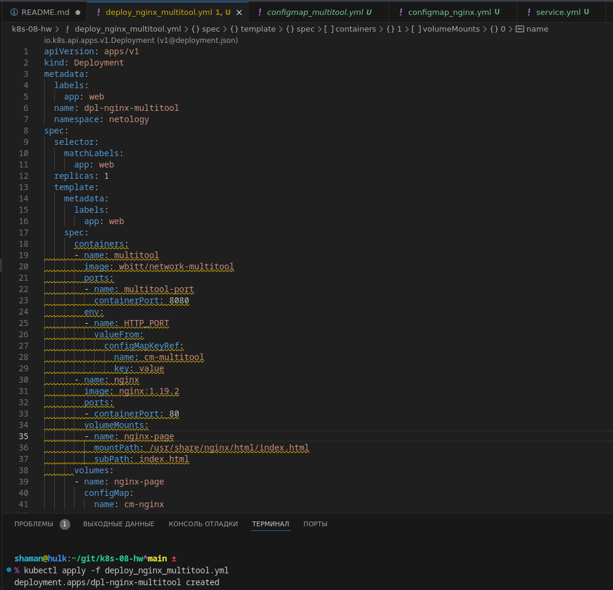

Запуск `ConfigMap`
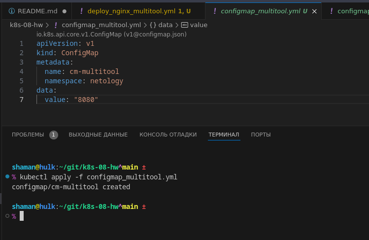

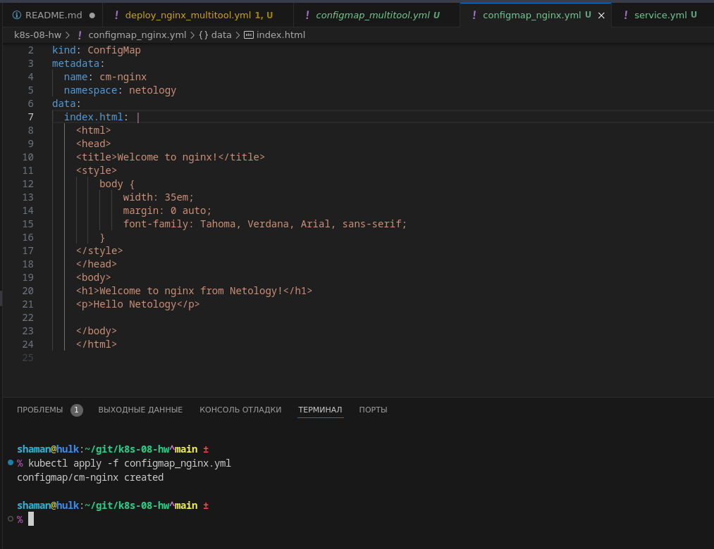

Запуск `Service`
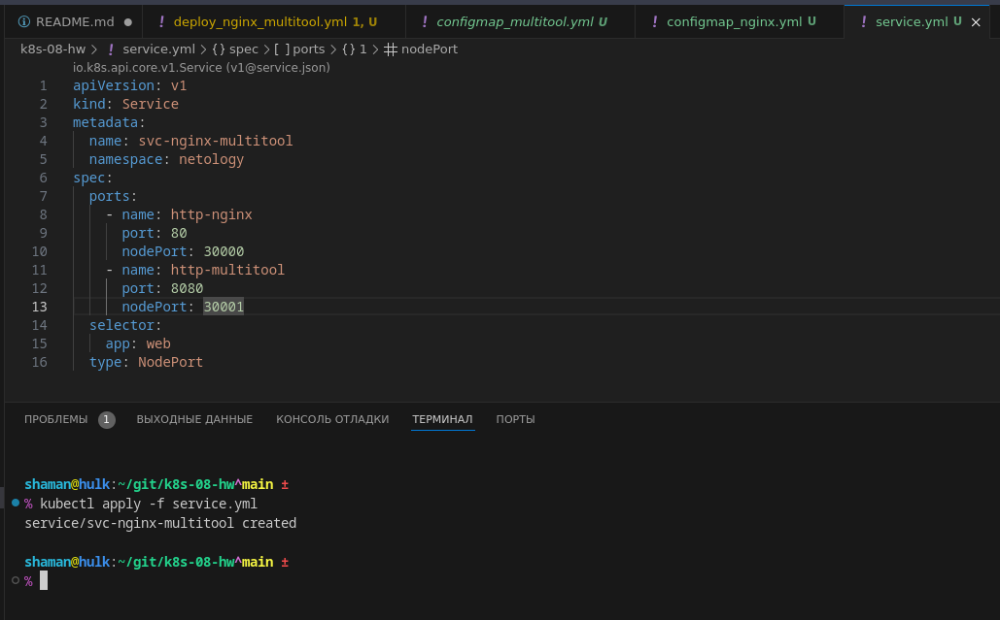

Проверка запуска `ConfigMap` и `Service`
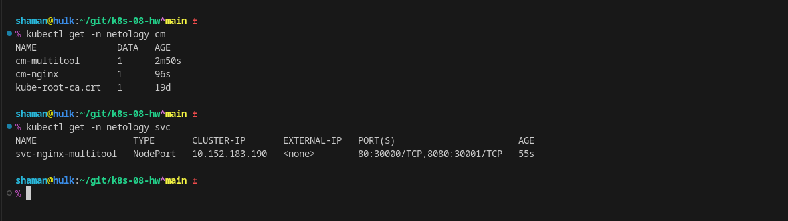

Проверка запуска `Deployment` и `Pod`
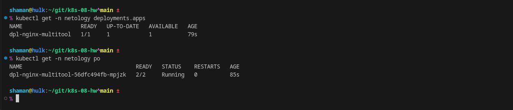

Вывод _curl_ и в _браузере_
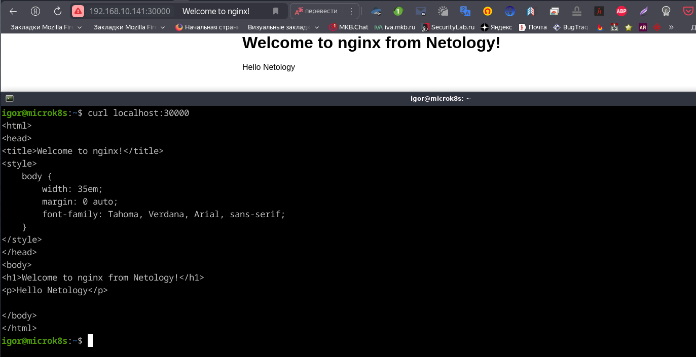

Листинг `deploy_nginx_multitool.yml`:
```
apiVersion: apps/v1
kind: Deployment
metadata:
  labels:
    app: web
  name: dpl-nginx-multitool
  namespace: netology
spec:
  selector:
    matchLabels:
      app: web
  replicas: 1
  template:
    metadata:
      labels:
        app: web
    spec:
      containers:
      - name: multitool
        image: wbitt/network-multitool
        ports:
        - name: multitool-port
          containerPort: 8080
        env:
        - name: HTTP_PORT
          valueFrom:
            configMapKeyRef:
              name: cm-multitool
              key: value
      - name: nginx
        image: nginx:1.19.2
        ports:
        - containerPort: 80
        volumeMounts:
        - name: nginx-page
          mountPath: /usr/share/nginx/html/index.html
          subPath: index.html
      volumes:
      - name: nginx-page
        configMap:
          name: cm-nginx
```

Листинг `configmap_multitool.yml`:
```
apiVersion: v1
kind: ConfigMap
metadata:
  name: cm-multitool
  namespace: netology
data:
  value: "8080"
```

Листинг `configmap_nginx.yml`:
```
apiVersion: v1
kind: ConfigMap
metadata:
  name: cm-nginx
  namespace: netology
data:
  index.html: |
    <html>
    <head>
    <title>Welcome to nginx!</title>
    <style>
        body {
            width: 35em;
            margin: 0 auto;
            font-family: Tahoma, Verdana, Arial, sans-serif;
        }
    </style>
    </head>
    <body>
    <h1>Welcome to nginx from Netology!</h1>
    <p>Hello Netology</p>

    </body>
    </html>
```

Листинг `service.yml`:
```
apiVersion: v1
kind: Service
metadata:
  name: svc-nginx-multitool
  namespace: netology
spec:
  ports:
    - name: http-nginx
      port: 80
      nodePort: 30000
    - name: http-multitool
      port: 8080
      nodePort: 30001
  selector:
    app: web
  type: NodePort
```


### Задание 2. Создать приложение с вашей веб-страницей, доступной по HTTPS

Создать `Deployment` приложения, состоящего из _Nginx_
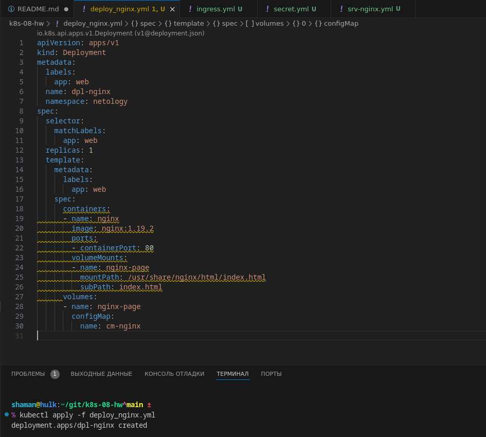

`ConfigMap` использовался из первого задания


Создать `Secret` для использования сертификата
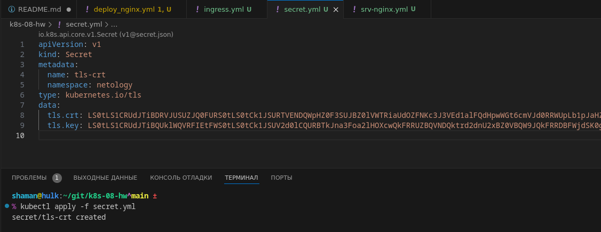

Запуск `Service`
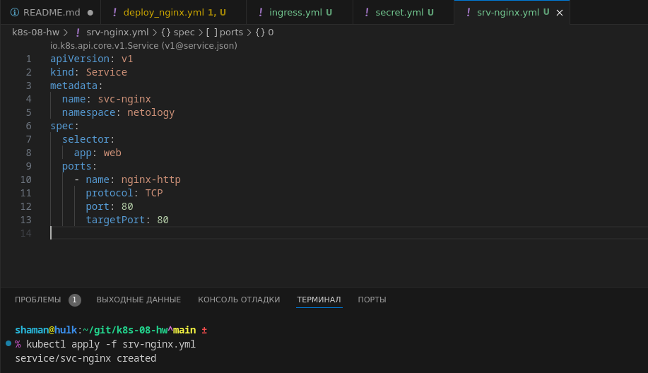

Запуск `Ingress`
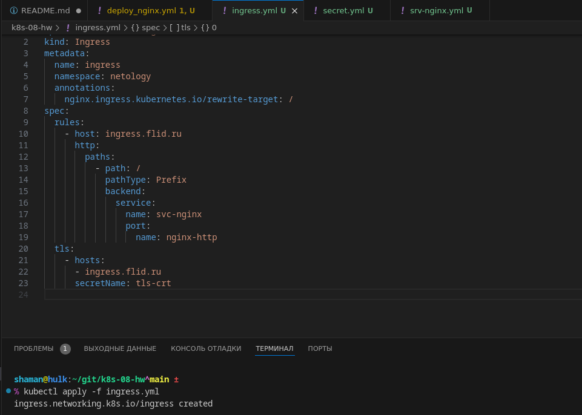

Вывод в _браузере_
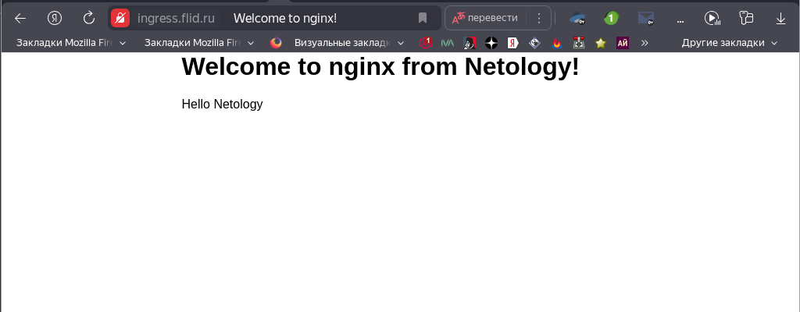

Данные Tls-сертификата
[Tls](img/k8s-08_08.png)


Для создания сертификатов, были использованны команды:
```
shaman@hulk:~/git/k8s-08-hw^main ±
% openssl req -x509 -days 365 -newkey rsa:2048 -sha256 -nodes -keyout nginx.key -out nginx.crt -subj "/CN=ingress.flid.ru"

shaman@hulk:~/git/k8s-08-hw^main ±
% kubectl create secret tls nginx-tls --cert=nginx.crt --key=nginx.key -n netology                                                                                     
secret/nginx-tls created

shaman@hulk:~/git/k8s-08-hw^main ±
% kubectl get secret -o yaml -n netology
```


Листинг `deploy_nginx.yml`:
```
apiVersion: apps/v1
kind: Deployment
metadata:
  labels:
    app: web
  name: dpl-nginx
  namespace: netology
spec:
  selector:
    matchLabels:
      app: web
  replicas: 1
  template:
    metadata:
      labels:
        app: web
    spec:
      containers:
      - name: nginx
        image: nginx:1.19.2
        ports:
        - containerPort: 80
        volumeMounts:
        - name: nginx-page
          mountPath: /usr/share/nginx/html/index.html
          subPath: index.html
      volumes:
      - name: nginx-page
        configMap:
          name: cm-nginx
```

Листинг `srv-nginx.yml`:
```
apiVersion: v1
kind: Service
metadata:
  name: svc-nginx
  namespace: netology
spec:
  selector:
    app: web
  ports:
    - name: nginx-http
      protocol: TCP
      port: 80
      targetPort: 80
```

Листинг `ingress.yml`:
```
apiVersion: networking.k8s.io/v1
kind: Ingress
metadata:
  name: ingress
  namespace: netology
  annotations:
    nginx.ingress.kubernetes.io/rewrite-target: /
spec:
  rules:
    - host: ingress.flid.ru
      http:
        paths:
          - path: /
            pathType: Prefix
            backend:
              service:
                name: svc-nginx
                port:
                  name: nginx-http
  tls:
    - hosts:
      - ingress.flid.ru
      secretName: tls-crt
```

Листинг `secret.yml`:
```
apiVersion: v1
kind: Secret
metadata:
  name: tls-crt
  namespace: netology
type: kubernetes.io/tls
data:
  tls.crt: LS0tLS1CRUdJTiBDRVJUSUZJQ0FURS0tLS0tCk1JSURTVENDQWpHZ0F3SUJBZ0lVWTRiaUdOZFNKc3J3VEd1alFQdHpwWGt6cmVJd0RRWUpLb1pJaHZjTkFRRUwKQlFBd05ERVlNQllHQTFVRUF3d1BhVzVuY21WemN5NW1iR2xrTG5KMU1SZ3dGZ1lEVlFRS0RBOXBibWR5WlhOegpMbVpzYVdRdWNuVXdIaGNOTWpRd05qTXdNVFF5TVRFeVdoY05NalV3TmpNd01UUXlNVEV5V2pBME1SZ3dGZ1lEClZRUUREQTlwYm1keVpYTnpMbVpzYVdRdWNuVXhHREFXQmdOVkJBb01EMmx1WjNKbGMzTXVabXhwWkM1eWRUQ0MKQVNJd0RRWUpLb1pJaHZjTkFRRUJCUUFEZ2dFUEFEQ0NBUW9DZ2dFQkFQUVJudEg0ZmlaMi9heFMyNi9pSXV0egowdUE1KzMvd0dNNVFuUzlFblpDYXg5eVJyUHdjZUU5Rm16bWJqZlZJZko5eUM5QVJHRVYzaE1Bbm9BU0g0a1o5CjA4c3BpYlZkUm5SdmZsL3dlOCthSm5Ib0ZQZjE2R2tPdTBNZFBrQkpBNm5XQ0wzNGpldmNkZU5tZGR1ek43VHQKZndzbnBzYUxSenJwU2FWcHJiVDNaOFpYWFZKeWxnNDZKaWh1eExZQkdUUmYyTmV4ZVZHcXlKcmo2WXYwWmNoSwpPWXc0RUFZR0M0c1VNWUpWekJKQ2VrUlEzbmxFbG02emtMejhpcSsyTHdkQUpaRWVndW9LUzlYNnpHYm1zMkFwCnVxMTVFRmdiTStVUVYxSGtXcTFFem0rSkNlckJFK0ZPTmQ2VW1rT3BuVlI0Q1l2RTd6RXpNSXl6b1F3SlMrc0MKQXdFQUFhTlRNRkV3SFFZRFZSME9CQllFRktkdmxGaGQ5bzUzam13dkNFYUdMRmZHWWE5d01COEdBMVVkSXdRWQpNQmFBRktkdmxGaGQ5bzUzam13dkNFYUdMRmZHWWE5d01BOEdBMVVkRXdFQi93UUZNQU1CQWY4d0RRWUpLb1pJCmh2Y05BUUVMQlFBRGdnRUJBSDVpdDl0OEJNWmlKTkVidlJiRUsvaWdRYnM3RmlPWjBycUowWStKVUgxK2Rjd08KZ1FleDV2T0pOemhlYW9DK3pScGYxSE5LdEZqbWxxdVkyYUdMcVVYNEo4S1V6ZnRZUjRBUWxmcGVRWHgvNDZ3cQpjN3RYTkM2WGZTTzkyb0p3OGlDcGpoaElkTTNLbTIyZG5RZTRNNktWQXE0YXI2S2tkcTBSSXM1SzFnVlM2VXlMCnhOeUhKdVFjNTlYZDN1NDZvb0g4VFJPQTVaaXUrWmRHSW55dlk2KysyK1BMTzc3czJQVmwwNmplbFVOeFhFVDQKRVRXbEViclR2U3BvRTdWM1dvV3RiaFlZQi9Gd2VBT3cvTVFTZ0QzY1R5SFVCYkk1TWR2UzRqbCt2V2R2MmhFRwpHT05OdnR3NVNCdGFQbXFMVTJSeGdGY0VaT3MwWTR5Z3FKRnRIVW89Ci0tLS0tRU5EIENFUlRJRklDQVRFLS0tLS0K
  tls.key: LS0tLS1CRUdJTiBQUklWQVRFIEtFWS0tLS0tCk1JSUV2d0lCQURBTkJna3Foa2lHOXcwQkFRRUZBQVNDQktrd2dnU2xBZ0VBQW9JQkFRRDBFWjdSK0g0bWR2MnMKVXR1djRpTHJjOUxnT2Z0LzhCak9VSjB2UkoyUW1zZmNrYXo4SEhoUFJaczVtNDMxU0h5ZmNndlFFUmhGZDRUQQpKNkFFaCtKR2ZkUExLWW0xWFVaMGIzNWY4SHZQbWlaeDZCVDM5ZWhwRHJ0REhUNUFTUU9wMWdpOStJM3IzSFhqClpuWGJzemUwN1g4TEo2YkdpMGM2NlVtbGFhMjA5MmZHVjExU2NwWU9PaVlvYnNTMkFSazBYOWpYc1hsUnFzaWEKNCttTDlHWElTam1NT0JBR0JndUxGREdDVmN3U1FucEVVTjU1UkpadXM1QzgvSXF2dGk4SFFDV1JIb0xxQ2t2Vgorc3htNXJOZ0ticXRlUkJZR3pQbEVGZFI1RnF0Uk01dmlRbnF3UlBoVGpYZWxKcERxWjFVZUFtTHhPOHhNekNNCnM2RU1DVXZyQWdNQkFBRUNnZ0VBREcvNEdPNXNkMGRVVy90ZVNKTTNLNnB3L09PQ01SM1V3SEZwTm54cytjUE8KeFlCWVFWZFl1MzYvajBCTVlVc2xWcUZpMVdLRVN4M3hFak1JRU5NS2hvUm8rT1JsVThHc3ZSMlFETHd6Z3Z2RwovbXo3akpDU2NiQVhmaThNK2d6K2RuYlFFVHVMb3BENXpQSEVDeGhuTy8xbm5ram5VeHpMMmh1dDdoT2tPaUY3CjhCejNyY3VRWGdKSlkxZ2F0UjgzNG5UT20yQ3VvN0ZTSnFBVG0zRHIxazhvWHBOUFppaHdoYTlSNmVNWUErQloKcGxKUjFtTTFUbHpDM09ETVprUTBnSVpESDJrbE1qQVhRRVk5c3FIcUpTNWtjREtsRVNGeXRZQldXS3FWRkYyTAp1Rkc5SHlRUThpcjFzc0I0aDdxblozYU5jUzlBU2R0M2lROU05Y05iTVFLQmdRRDY0SU9OOXJyeFM4RXF2bGdDCjRNY2tMUnFMNjZ4VU1qUWVxeVA2d3RGcW9XTURjTERSRzI2RGs2OS9oOU9tUVpxVTl1ZkJRa1JrMGxMbUsxK0kKUUFUang3Zis1b2N4SkJPZzlQR0hQUG9PVU9ncjYrMm1NT0dmOTc2ODlWOVAxeEl2RkF5L1JBRml3Y0toL3I0awpJbkJ4VkpaY1VhNFVSSmhiVGJTbVhURGhHUUtCZ1FENURZUWErN095TzRMRGJ4VzBvWXFmWVJ1UjhxUXRDbW1FClRhalJBUTNIRDNrTzRZYUlRNmF1bmI3U0I1MmZmazBTTWlaSTdpWnFyTE1ubUJxUzJSOWpLTldzOXQzLzFHM2gKNmhoRllMeUYycHE4WHdtUlE1L0x3c1drejhtcTNwVHdIRHh1SnN4YjF4QWZqNHJJTDRzb0FTbVY4Yk14bkt4TwpQakRoTkF2aG93S0JnUUNuZ2F5VTV6NmV5Z1BwOURsemduMjBxK0RqdDdIU2JjcmJCMDM0cW9lRStNalJqVGFpCkIvemNJWW0yVHd5RUg1MkZCTzVzM1VBcFNUMU1yWDBWemhqMXRXNG01ZWt5YUhJcXNDRnNPTXlGTG9RMmYwcW8KQWs5RHJmbE8xVTZVVW5lenMyRm5lNUtwUzlJV3M2NWxGaEdadWU3REtVNWYvZ1QwUVlmeTVKbzBVUUtCZ1FEbwpySXJ0MXBjei9Vc1dJSExMMVZ1M3VMWlVMTGJhNlc1WXoyRFhHai92NS9HMlNGWXllZG1BS3hsNkNPbG1kMDJ6Cm9TeUpXQXlGL3FCRmJtSHRMWEdZWnk3eEw1V0ppOEc0bk1aZUVwa3VDR1FsZGpodkFSbUorSVpEaW1paS9OMXkKVVQ3WHZlR1FMNlQ5aDFJbDRkMEUyOGtwTDZ5MHZlVndGOFA4c1c0a053S0JnUUR2NDBjcmdTaXI5R3p2UHFWQwpEMVZianZCNmE0WTNWanRwSzlBRHk3NkpxZlZjWGNtckJmZVpaOFVlRjZUUXR0bHFhenFtUmNzRjR5b0EwaFBkCit4MzNFU3doRE9lYjhyQVJZL3VySGRRL1NoV3FGRGI2azArNGtpY00xNHRQT3N4aGR3eEpYZVhybHNvcEFtOHIKRHIwS3k4UW9HdGg1RkdyQWlVUHQ3VUc3Z2c9PQotLS0tLUVORCBQUklWQVRFIEtFWS0tLS0tCg==
```

Листинг `configmap_nginx.yml`:
```
apiVersion: v1
kind: ConfigMap
metadata:
  name: cm-nginx
  namespace: netology
data:
  index.html: |
    <html>
    <head>
    <title>Welcome to nginx!</title>
    <style>
        body {
            width: 35em;
            margin: 0 auto;
            font-family: Tahoma, Verdana, Arial, sans-serif;
        }
    </style>
    </head>
    <body>
    <h1>Welcome to nginx from Netology!</h1>
    <p>Hello Netology</p>

    </body>
    </html>
```


---